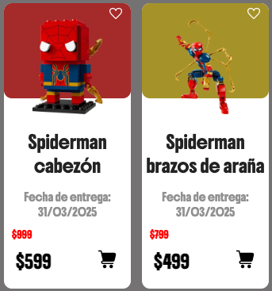
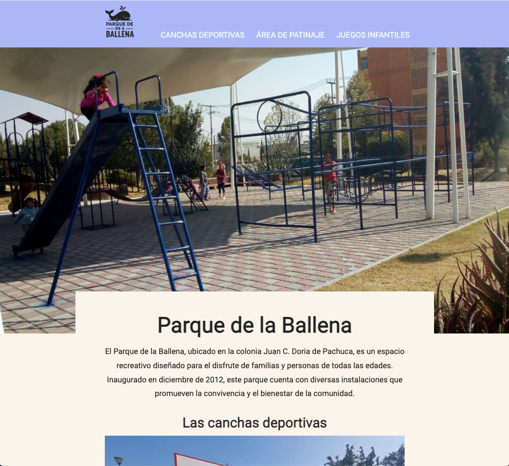

# Tarjetas y página web sin flexbox

## Teoría
Este ejercicio no usa flexbox con la intención de practicar con los alumnos del módulo 2, algunas propiedades:
* position
* display
* box-sizing
* box model

## Nos basamos en:
[Tarjetas de figuras](https://essentialwebapps.com/css/css-cards/ "Figurine Product Card with CSS")

[Chicago’s Millennium Park](https://www.choosechicago.com/articles/parks-outdoors/millennium-park-campus/ "página del millenium park")

## Resultados visuales

